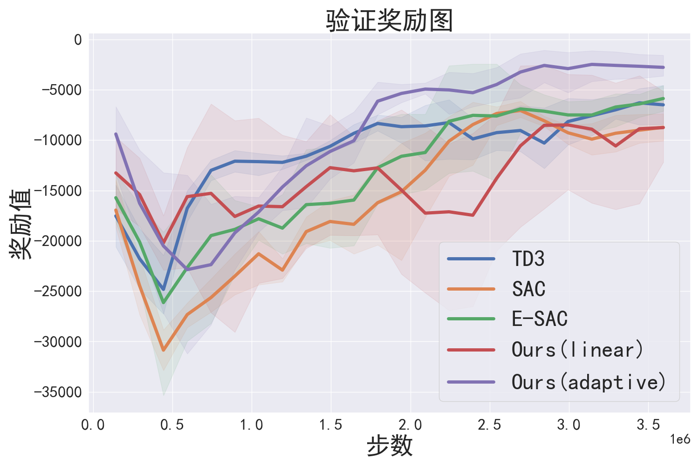
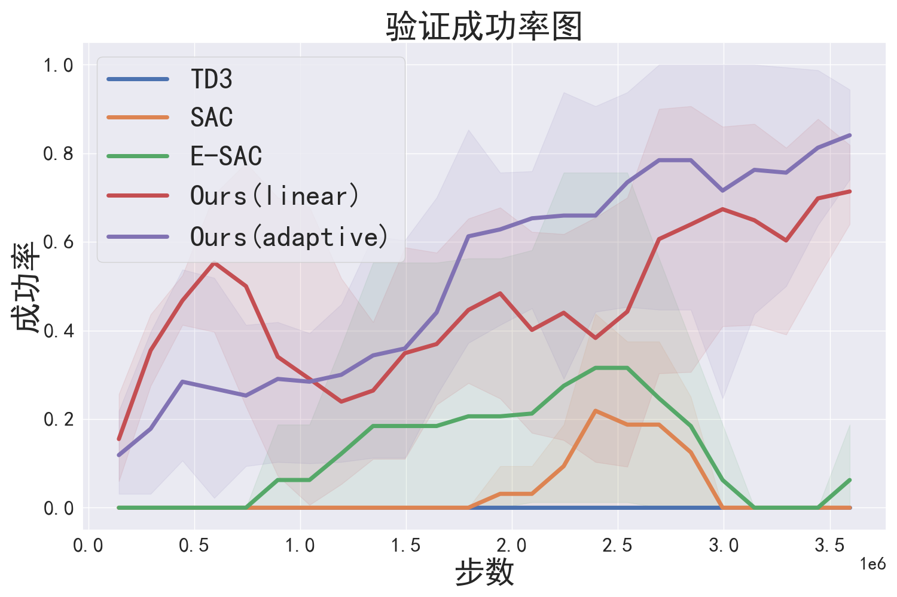

# An Imitative Reinforcement Learning Approach for Dogfight

## 实验结果

<p float="left">
  
  
</p>


## 模型
BC、TD3、SAC、E-SAC、本文提出的方法训练的最佳模型存储在results文件夹下，模型验证结果如下表所示（每个模型的成功率和随机初始化成功率使用5个不同的随机种子运行50个回合得到，±表示标准差；命中率运行10个回合得到；加粗表示最佳结果）
### 最佳模型验证成功率及奖励值
| **算法**              | **击落成功率**        | **命中成功率**        | **奖励值**           |
|:-----------------:|:-----------------:|:-----------------:|:-----------------:|
| Ours(adaptive)  | **100.0% ± 0.0%**     | **100.0% ± 0.0%**     | **-680.8 ± 6.7**      |
| Ours(linear)    | **100.0% ± 0.0%**     | **100.0% ± 0.0%**    | -953.9 ± 13.8     |
| TD3             | 0.0% ± 0.0%       | 0.0% ± 0.0%       | -4707.2 ± 0.0     |
| E-SAC           | **100.0% ± 0.0%**     | **100.0% ± 0.0%**     | -1431.2 ± 0.2     |
| SAC             | **100.0% ± 0.0%**     | 0.0% ± 0.0%       | -2985.7 ± 0.0     |
| BC              | 62.8% ± 1.0%      | 62.8% ± 1.0%      | -12228.3 ± 880.2  |
### 最佳模型随机初始化验证成功率及奖励值
| **算法**             | **击落成功率**       | **命中成功率**       | **奖励值**               |
|:-----------------:|:----------------:|:----------------:|:---------------------:|
| Ours(adaptive)  | **98.0% ± 1.3%**     | **98.0% ± 1.3%**     | **-1436.0 ± 238.9**       |
| Ours(linear)    | 86.0% ± 5.4%     | 86.0% ± 5.4%     | -5800.8 ± 1420.3      |
| TD3             | 0.0% ± 0.0%      | 0.0% ± 0.0%      | -5720.9 ± 715.8       |
| E-SAC           | 90.0% ± 2.8%     | 90.0% ± 2.8%     | -3722.2 ± 395.5       |
| SAC             | 44.0% ± 3.3%     | 0.0% ± 0.0%      | -8318.1 ± 822.8       |
| BC              | 22.4% ± 3.2%     | 22.4% ± 3.2%     | -20504.7 ± 1156.3     |

### 开火效率
| **算法**             | **命中次数/发射次数** |
|:-----------------:|:-----------------:|
| Ours(adaptive)  | **100.0%**          |
| Ours(linear)    | **100.0%**          |
| E-SAC           | 11.4%           |
| BC              | 92.3%           |


## 本文方法训练得到的策略

单一炮弹场景下的策略


无限炮弹场景下的策略


## 配置
1. 安装`Harfang3D sandbox`的[Release版本](https://github.com/harfang3d/dogfight-sandbox-hg2/releases/tag/v1.3.0)或[源代码](https://github.com/harfang3d/dogfight-sandbox-hg2)，推荐安装源代码版本，这样可以自行更改环境的端口
2. 安装本代码所需依赖
    ```
    conda env create -f environment.yaml
    ```
## 训练
1. 在`Harfang3D sandbox`下的`source`文件夹，使用以下命令打开`Harfang3D sandbox`，使用`network_port`指定端口号，打开后进入网络模式（NETWORK MODE）
    ```
    python main.py network_port 12345
    ```
2. 在`本代码`文件夹下使用以下命令进行训练（注意修改代码`train_all.py`中的IP号，使用--render开启训练渲染，使用--plot绘制可视化结果）
    ```
    # 自适应权重NIRL
    python train_all.py --agent ROT --port 12345 --type soft --model_name srot
    ```
    ```
    # 线性权重NIRL
    python train_all.py --agent ROT --port 12345 --type linear --bc_weight 1 --model_name lrot
    ```
    ```
    # 固定权重NIRL
    python train_all.py --agent ROT --port 12345 --type fixed --bc_weight 0.5 --model_name frot
    ```
    ```
    # TD3
    python train_all.py --agent TD3 --port 12345 --model_name td3
    ```
    ```
    # BC
    python train_all.py --agent BC --port 12345 --model_name bc
    ```
    ```
    # SAC
    python train_sac.py --type sac --port 12345 --model_name sac
    ```
    ```
    # E-SAC
    python train_sac.py --type esac --port 12345 --model_name esac
    ```
## 测试
1. 在`Harfang3D sandbox`下的`source`文件夹，使用以下命令打开`Harfang3D sandbox`，使用`network_port`指定端口号，打开后进入网络模式
    ```
    python main.py network_port 12345
    ```
2. BC、TD3、NIRL方法在`本代码`文件夹下使用以下命令进行测试（注意修改代码`train_all.py`中的IP号及导入模型名称（仅需‘xxx_Harfang_GYM之前的名称’），使用--render开启测试渲染）
    ```
    # 成功率测试
    # 在相应训练代码后添加'--test --test_mode 1'即可，其中test mode 1为随机初始化，test mode 2为无限导弹，test mode 3为原始环境测试
    # 以下为一个例子
    python train_all.py --agent ROT --port 12345 --type soft --model_name srot --test --test_mode 1 --seed 1
    ```
    ```
    # 奖励测试
    # 在相应训练代码后添加'--test --test_mode 4'即可，其中test mode 4为随机初始化，test mode 5为原始环境测试
    # 以下为一个例子
    python train_all.py --agent ROT --port 12345 --type soft --model_name srot --test --test_mode 4 --seed 1
    ```
3. SAC、E-SAC方法在`本代码`文件夹下使用以下命令进行测试（测试模式类型同上）
    ```
    python validate_sac.py --test_mode 1 --port 12345 --seed 1 
    ```

